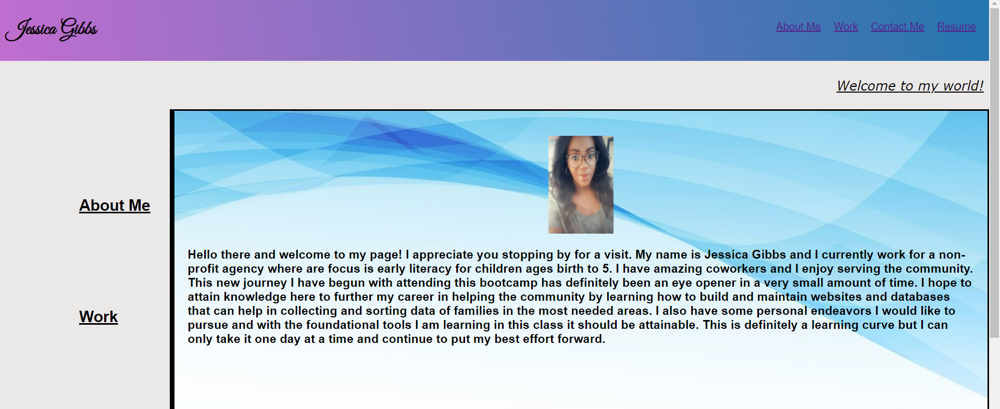

# Portfolio
Description

Here we have a quick and simple portfolio that I will continue to develop over time as my skills progress

I have an "About Me" section with a brief bio about myself and how I began this process.
My "Work" section has my latest Project as well as two deployed websites I have created. The "Contact Me" portion has my direct contact information and if you click on "Resume" a pdf copy of my resume will be available. 

Deployed site: https://jess20005.github.io/Portfolio/